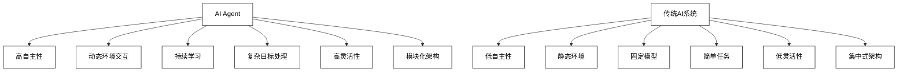

# 第一部分：AI Agent 基础

# 第1章：AI Agent 概述

## 1.1 什么是 AI Agent

### 1.1.1 AI Agent 的定义

AI Agent（人工智能代理）是一个能够感知环境、做出决策并采取行动以实现特定目标的智能系统。它是人工智能研究和应用的核心概念之一，代表了一种能够自主运作、适应环境并解决复杂问题的智能实体。

从技术角度来看，AI Agent 可以定义为：

一个由软件（有时也包括硬件）构成的系统，它能够：
1. 感知环境状态
2. 根据预设目标和内部逻辑做出决策
3. 执行行动以改变环境或达成目标
4. 学习和适应以提高未来表现

数学表示：

我们可以将 AI Agent 形式化表示为一个四元组：

$A = (S, A, P, R)$

其中：
- $S$ 是可能的环境状态集合
- $A$ 是 Agent 可执行的动作集合
- $P: S \times A \times S \rightarrow [0, 1]$ 是状态转移概率函数
- $R: S \times A \rightarrow \mathbb{R}$ 是奖励函数

Agent 的目标是找到一个最优策略 $\pi^*: S \rightarrow A$，使得期望累积奖励最大化：

$\pi^* = \arg\max_\pi \mathbb{E}[\sum_{t=0}^{\infty} \gamma^t R(s_t, \pi(s_t))]$

其中 $\gamma \in [0, 1]$ 是折扣因子。

### 1.1.2 AI Agent 的特征

AI Agent 具有以下关键特征：

1. **自主性**：能够在没有直接人类干预的情况下做出决策和采取行动。

2. **反应性**：能够及时感知环境变化并做出相应反应。

3. **主动性**：不仅被动响应环境，还能主动采取行动以实现目标。

4. **社交能力**：能与其他 Agent 或人类进行交互和协作。

5. **适应性**：能够学习和改进自身行为以适应新的情况。

6. **目标导向**：所有行为都是为了实现预定的目标或优化某些性能指标。

7. **持续运行**：能够长期持续地运行和执行任务。

8. **可解释性**（理想情况下）：能够解释自己的决策和行为过程。

### 1.1.3 AI Agent 与传统 AI 系统的区别

AI Agent 与传统 AI 系统有几个关键区别：

1. **自主性程度**
   - AI Agent：高度自主，能独立做决策和采取行动。
   - 传统 AI：通常需要更多人类干预和控制。

2. **环境交互**
   - AI Agent：持续与环境交互，适应动态变化。
   - 传统 AI：往往在静态或受控环境中运行。

3. **学习能力**
   - AI Agent：通常具有在线学习和适应能力。
   - 传统 AI：学习能力有限，主要依赖预先训练。

4. **目标设定**
   - AI Agent：可以处理复杂、长期的目标。
   - 传统 AI：通常针对特定、明确定义的任务。

5. **灵活性**
   - AI Agent：能处理不确定性和未预见的情况。
   - 传统 AI：在预定义场景外表现欠佳。

6. **系统架构**
   - AI Agent：通常采用模块化、分布式架构。
   - 传统 AI：倾向于使用单一、集中式的处理模型。

比较表格：

| 特征 | AI Agent | 传统 AI 系统 |
|------|----------|--------------|
| 自主性 | 高 | 低 |
| 环境交互 | 动态、持续 | 静态、间歇 |
| 学习能力 | 在线、持续学习 | 离线、固定模型 |
| 目标处理 | 复杂、长期目标 | 简单、短期任务 |
| 灵活性 | 高 | 低 |
| 系统架构 | 模块化、分布式 | 集中式、单一 |



## 1.2 AI Agent 的发展历程

### 1.2.1 早期 AI Agent 研究

AI Agent 的概念可以追溯到人工智能研究的早期阶段。以下是一些关键的里程碑：

1. **1950年代：符号系统假说**
   - Allen Newell 和 Herbert Simon 提出了物理符号系统假说，为早期 AI Agent 奠定了理论基础。

2. **1960年代：通用问题求解器（GPS）**
   - Newell 和 Simon 开发了 GPS，这是一个早期尝试创建通用 AI Agent 的系统。

3. **1970年代：专家系统**
   - MYCIN 等专家系统开始出现，这些系统可以在特定领域模拟人类专家的决策过程。

4. **1980年代：反应式 Agent**
   - Rodney Brooks 提出了行为主义 AI，强调直接的感知-行动映射，而不是复杂的内部表示。

时间轴：

```mermaid
timeline
    title AI Agent 早期发展历程
    1950年代 : 符号系统假说
    1960年代 : 通用问题求解器(GPS)
    1970年代 : 专家系统
    1980年代 : 反应式Agent

%% 自定义样式
classDef default fill:#ffffff,stroke:#000000,color:#000000;
```

### 1.2.2 机器学习时代的 AI Agent

随着机器学习技术的发展，AI Agent 的能力得到了显著提升：

1. **1990年代：强化学习的兴起**
   - Q-learning 和 TD-learning 等算法的发展使 Agent 能够通过与环境交互来学习最优策略。

2. **2000年代初：概率图模型**
   - 贝叶斯网络和马尔可夫决策过程为处理不确定性提供了强大工具。

3. **2000年代中期：支持向量机和决策树**
   - 这些算法提高了 Agent 的分类和决策能力。

4. **2010年代初：深度学习革命**
   - 深度神经网络，特别是卷积神经网络（CNN）和循环神经网络（RNN），大大提升了 Agent 的感知和序列处理能力。

5. **2010年代中期：深度强化学习**
   - DeepMind 的 DQN 算法在 Atari 游戏上的成功标志着深度强化学习的突破，使 Agent 能够学习复杂的策略。

时间轴：

```mermaid
timeline
    title 机器学习时代的 AI Agent 发展
    1990年代 : 强化学习兴起
    2000年代初 : 概率图模型
    2000年代中期 : 支持向量机和决策树
    2010年代初 : 深度学习革命
    2010年代中期 : 深度强化学习

%% 自定义样式
classDef default fill:#ffffff,stroke:#000000,color:#000000;
```

### 1.2.3 大语言模型驱动的 AI Agent

近年来，大语言模型（LLM）的出现为 AI Agent 的发展带来了革命性的变化：

1. **2018年：BERT 的出现**
   - BERT 模型引入了双向编码器表示，大大提高了自然语言处理任务的性能。

2. **2019年：GPT-2 的突破**
   - OpenAI 发布的 GPT-2 展示了大规模语言模型的潜力，能够生成连贯的长文本。

3. **2020年：GPT-3 的惊人能力**
   - GPT-3 以其 1750 亿参数的规模和多任务能力震惊了 AI 社区，开启了基于大语言模型的 AI Agent 时代。

4. **2022年：ChatGPT 的爆发**
   - OpenAI 发布的 ChatGPT 展示了惊人的对话能力和任务适应性，引发了广泛的商业应用。

5. **2023年及以后：多模态大模型**
   - 如 GPT-4 等模型开始整合文本、图像等多种模态，进一步扩展了 AI Agent 的能力边界。

LLM 驱动的 AI Agent 特点：

- **通用性**：能够处理广泛的任务，从文本生成到问答、翻译等。
- **上下文理解**：能够理解和维护长期上下文，提供连贯的交互。
- **少样本学习**：通过提示工程，能够快速适应新任务。
- **知识整合**：在预训练过程中整合了大量知识，可以作为知识库使用。
- **自然语言交互**：提供了更自然、更人性化的交互界面。

时间轴：

```mermaid
timeline
    title 大语言模型驱动的 AI Agent 发展
    2018 : BERT 出现
    2019 : GPT-2 突破
    2020 : GPT-3 惊人能力
    2022 : ChatGPT 爆发
    2023及以后 : 多模态大模型

%% 自定义样式
classDef default fill:#ffffff,stroke:#000000,color:#000000;
```

## 1.3 AI Agent 的应用场景

AI Agent 的应用范围极其广泛，涵盖了多个行业和领域。以下是一些主要的应用场景：

### 1.3.1 智能助手

智能助手是 AI Agent 最直接和广泛的应用之一，它们能够理解自然语言指令，执行各种任务，并与用户进行自然对话。

1. **个人助理**
   - 例如：Siri、Google Assistant、Alexa
   - 功能：日程管理、提醒、信息查询、智能家居控制

2. **客户服务**
   - 应用：在线客服聊天机器人、电话客服系统
   - 优势：24/7 可用、快速响应、处理大量并发请求

3. **写作助手**
   - 例如：基于 GPT 的写作工具
   - 功能：文章生成、创意写作、文本润色

4. **编程助手**
   - 应用：代码补全、bug 修复建议、代码解释
   - 例如：GitHub Copilot

实现示例（Python代码）：

```python
import openai

class WritingAssistant:
    def __init__(self, api_key):
        openai.api_key = api_key

    def generate_text(self, prompt, max_tokens=100):
        response = openai.Completion.create(
            engine="text-davinci-002",
            prompt=prompt,
            max_tokens=max_tokens
        )
        return response.choices[0].text.strip()

    def improve_text(self, original_text):
        prompt = f"Improve the following text:\n\n{original_text}\n\nImproved version:"
        return self.generate_text(prompt, max_tokens=200)

# 使用示例
assistant = WritingAssistant("your-api-key-here")
original = "The cat sat on the mat."
improved = assistant.improve_text(original)
print(f"Original: {original}")
print(f"Improved: {improved}")
```

### 1.3.2 自动化任务执行

AI Agent 可以自动执行各种复杂的任务，提高效率并减少人为错误。

1. **工作流自动化**
   - 应用：自动化报告生成、数据处理、文档管理
   - 优势：提高效率、减少重复性工作

2. **智能调度系统**
   - 应用：物流路线优化、工厂生产调度、人员排班
   - 特点：考虑多种约束条件，实时优化

3. **自动化测试**
   - 应用：软件测试、网站功能验证
   - 优势：快速、全面、可重复执行

4. **金融交易**
   - 应用：算法交易、风险管理、欺诈检测
   - 特点：高速决策、大数据分析

实现示例（Python代码）：

```python
import schedule
import time
import random

class AutomatedTradingAgent:
    def __init__(self):
        self.balance = 10000  # 初始资金

    def analyze_market(self):
        # 模拟市场分析，返回买入或卖出信号
        return random.choice(['buy', 'sell', 'hold'])

    def execute_trade(self):
        action = self.analyze_market()
        amount = random.randint(100, 1000)
        
        if action == 'buy' and self.balance >= amount:
            self.balance -= amountprint(f"Executed {action} order for ${amount}. New balance: ${self.balance}")
        elif action == 'sell':
            self.balance += amount
            print(f"Executed {action} order for ${amount}. New balance: ${self.balance}")
        else:
            print("Holding position. No trade executed.")

def run_trading_bot():
    agent = AutomatedTradingAgent()
    schedule.every(1).minutes.do(agent.execute_trade)

    while True:
        schedule.run_pending()
        time.sleep(1)

# 启动交易机器人
run_trading_bot()
```

### 1.3.3 决策支持系统

AI Agent 在复杂决策过程中可以提供valuable insights和建议，辅助人类做出更好的决策。

1. **医疗诊断辅助**
   - 应用：疾病诊断、治疗方案推荐、医学影像分析
   - 优势：结合大量医学知识和患者数据，提供准确诊断建议

2. **金融投资顾问**
   - 应用：投资组合优化、风险评估、市场趋势分析
   - 特点：考虑多种因素，提供个性化投资建议

3. **法律咨询系统**
   - 应用：案例分析、法律文件审查、合规性检查
   - 优势：快速检索和分析大量法律文献

4. **企业战略规划**
   - 应用：市场分析、竞争对手情报、资源分配优化
   - 特点：整合多源数据，提供全面的决策支持

实现示例（Python代码）：

```python
import numpy as np
from sklearn.ensemble import RandomForestClassifier
from sklearn.model_selection import train_test_split

class MedicalDiagnosisAgent:
    def __init__(self):
        self.model = RandomForestClassifier(n_estimators=100)

    def train(self, X, y):
        X_train, X_test, y_train, y_test = train_test_split(X, y, test_size=0.2)
        self.model.fit(X_train, y_train)
        accuracy = self.model.score(X_test, y_test)
        print(f"Model trained with accuracy: {accuracy:.2f}")

    def diagnose(self, symptoms):
        prediction = self.model.predict([symptoms])
        probability = np.max(self.model.predict_proba([symptoms]))
        return prediction[0], probability

# 使用示例
# 假设我们有一个症状数据集和对应的诊断结果
symptoms_data = np.random.rand(1000, 10)  # 1000 患者，每个有 10 种症状
diagnoses = np.random.choice(['Flu', 'Cold', 'Allergy'], 1000)

agent = MedicalDiagnosisAgent()
agent.train(symptoms_data, diagnoses)

# 诊断新患者
new_patient_symptoms = np.random.rand(10)
diagnosis, confidence = agent.diagnose(new_patient_symptoms)
print(f"Diagnosis: {diagnosis}, Confidence: {confidence:.2f}")
```

## 1.4 AI Agent 的核心组件

AI Agent 的设计通常包含几个核心组件，这些组件共同工作以实现智能行为。

### 1.4.1 感知模块

感知模块负责从环境中收集信息，是 AI Agent 与外界交互的主要接口。

主要功能：
1. 数据采集：从各种传感器或数据源获取原始数据
2. 信号处理：对原始数据进行滤波、降噪等预处理
3. 特征提取：从处理后的数据中提取有意义的特征

技术实现：
- 计算机视觉：使用卷积神经网络（CNN）处理图像和视频数据
- 自然语言处理：使用循环神经网络（RNN）或Transformer模型处理文本数据
- 语音识别：使用声学模型和语言模型将语音转换为文本

示例代码（使用 OpenCV 进行图像处理）：

```python
import cv2
import numpy as np

class PerceptionModule:
    def __init__(self):
        self.face_cascade = cv2.CascadeClassifier(cv2.data.haarcascades + 'haarcascade_frontalface_default.xml')

    def process_image(self, image):
        gray = cv2.cvtColor(image, cv2.COLOR_BGR2GRAY)
        faces = self.face_cascade.detectMultiScale(gray, 1.1, 4)
        for (x, y, w, h) in faces:
            cv2.rectangle(image, (x, y), (x+w, y+h), (255, 0, 0), 2)
        return image, len(faces)

# 使用示例
perception = PerceptionModule()
img = cv2.imread('example.jpg')
processed_img, face_count = perception.process_image(img)
print(f"Detected {face_count} faces")
cv2.imshow('Processed Image', processed_img)
cv2.waitKey(0)
cv2.destroyAllWindows()
```

### 1.4.2 推理与决策模块

推理与决策模块是 AI Agent 的"大脑"，负责处理感知模块提供的信息，并做出相应的决策。

主要功能：
1. 状态估计：根据当前感知信息和历史数据估计环境状态
2. 策略选择：根据当前状态和目标选择最佳行动
3. 规划：制定达成长期目标的行动序列

技术实现：
- 规则基推理：使用预定义的 if-then 规则
- 概率推理：使用贝叶斯网络或马尔可夫决策过程
- 强化学习：通过与环境交互学习最优策略

示例代码（简单的强化学习 Agent）：

```python
import numpy as np

class RLAgent:
    def __init__(self, state_size, action_size):
        self.state_size = state_size
        self.action_size = action_size
        self.q_table = np.zeros((state_size, action_size))
        self.learning_rate = 0.1
        self.discount_factor = 0.99
        self.epsilon = 0.1

    def get_action(self, state):
        if np.random.rand() < self.epsilon:
            return np.random.randint(self.action_size)
        return np.argmax(self.q_table[state, :])

    def learn(self, state, action, reward, next_state):
        current_q = self.q_table[state, action]
        max_next_q = np.max(self.q_table[next_state, :])
        new_q = (1 - self.learning_rate) * current_q + self.learning_rate * (reward + self.discount_factor * max_next_q)
        self.q_table[state, action] = new_q

# 使用示例
agent = RLAgent(state_size=10, action_size=4)
state = 0
for _ in range(1000):
    action = agent.get_action(state)
    next_state = np.random.randint(10)
    reward = 1 if next_state > state else -1
    agent.learn(state, action, reward, next_state)
    state = next_state

print("Learned Q-table:")
print(agent.q_table)
```

### 1.4.3 执行模块

执行模块负责将决策转化为实际的行动，与环境进行交互。

主要功能：
1. 动作执行：将高级决策转换为具体的操作指令
2. 反馈收集：监控执行结果，收集反馈信息
3. 错误处理：处理执行过程中可能出现的异常情况

技术实现：
- 机器人控制：使用逆运动学算法控制机器人关节
- 自然语言生成：使用序列到序列模型生成自然语言响应
- API 调用：通过 API 与外部系统交互

示例代码（简单的自然语言生成）：

```python
import random

class ExecutionModule:
    def __init__(self):
        self.templates = {
            'greeting': ['Hello!', 'Hi there!', 'Greetings!'],
            'farewell': ['Goodbye!', 'See you later!', 'Take care!'],
            'weather': ['The weather is {}.', "It's {} today.", 'Expect {} conditions.']
        }

    def generate_response(self, intent, **kwargs):
        if intent in self.templates:
            template = random.choice(self.templates[intent])
            return template.format(**kwargs) if kwargs else template
        return "I'm not sure how to respond to that."

    def execute_action(self, action, **params):
        if action == 'speak':
            return self.generate_response(**params)
        elif action == 'move':
            return f"Moving to coordinates: {params.get('x', 0)}, {params.get('y', 0)}"
        else:
            return f"Unsupported action: {action}"

# 使用示例
execution = ExecutionModule()
print(execution.execute_action('speak', intent='greeting'))
print(execution.execute_action('speak', intent='weather', weather='sunny'))
print(execution.execute_action('move', x=10, y=20))
```

### 1.4.4 学习与适应模块

学习与适应模块使 AI Agent 能够从经验中学习，不断改进其性能。

主要功能：
1. 经验收集：存储 Agent 与环境交互的历史数据
2. 模型更新：根据新的经验调整内部模型
3. 探索与利用：平衡已知知识的利用和新知识的探索

技术实现：
- 监督学习：使用标记数据训练分类或回归模型
- 无监督学习：从未标记数据中发现模式
- 强化学习：通过试错学习最优策略
- 迁移学习：将在一个任务上学到的知识应用到新任务

示例代码（在线学习的线性回归模型）：

```python
import numpy as np

class OnlineLearningModule:
    def __init__(self, feature_dim):
        self.weights = np.zeros(feature_dim)
        self.learning_rate = 0.01

    def predict(self, features):
        return np.dot(features, self.weights)

    def update(self, features, true_value):
        prediction = self.predict(features)
        error = true_value - prediction
        self.weights += self.learning_rate * error * features

    def learn_and_adapt(self, data_stream):
        for features, true_value in data_stream:
            prediction = self.predict(features)
            print(f"Prediction: {prediction:.2f}, True Value: {true_value:.2f}")
            self.update(features, true_value)
        print("Final weights:", self.weights)

# 使用示例
np.random.seed(0)
feature_dim = 3
learner = OnlineLearningModule(feature_dim)

# 模拟数据流
data_stream = [(np.random.rand(feature_dim), 2 * np.random.rand()) for _ in range(100)]

learner.learn_and_adapt(data_stream)
```

这些核心组件共同工作，使 AI Agent 能够感知环境、做出决策、执行行动并从经验中学习。每个组件都可以根据具体应用场景进行定制和优化，以满足不同的需求和挑战。

在实际的 AI Agent 系统中，这些组件通常是紧密集成的，并且可能有更复杂的架构和实现。随着技术的发展，特别是大语言模型的出现，这些组件的边界可能会变得更加模糊，形成更加统一和灵活的智能系统。
