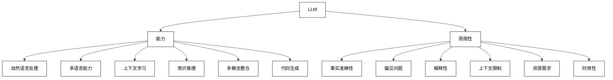
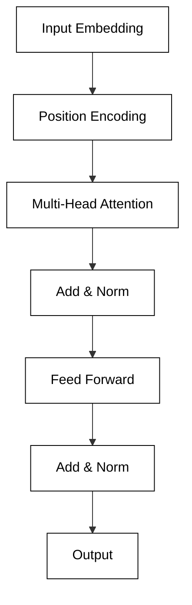
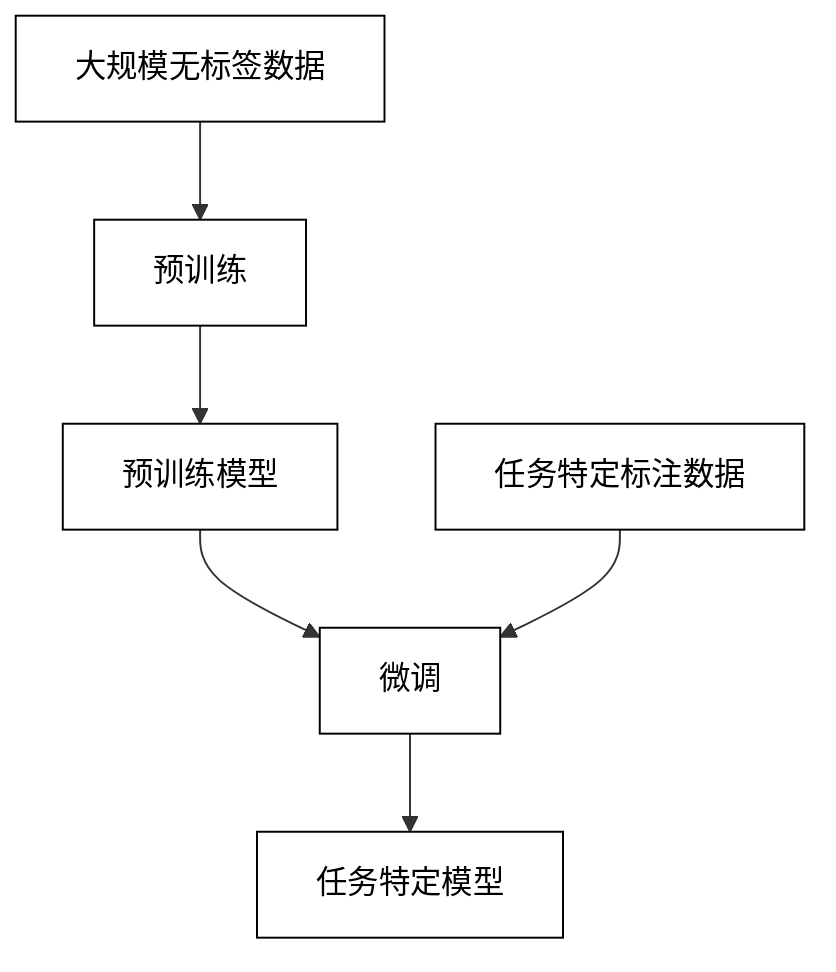

# 第2章：大语言模型（LLM）基础

## 2.1 LLM 概述

### 2.1.1 LLM 的定义与特点

大语言模型（Large Language Models，LLMs）是一类基于深度学习技术，通过大规模预训练在自然语言处理任务上取得突破性进展的模型。

定义：
LLM 是一种使用海量文本数据训练的神经网络模型，能够理解和生成人类语言，执行各种语言相关任务。

主要特点：
1. **规模巨大**：通常包含数十亿到数千亿个参数。
2. **自监督学习**：主要通过预测下一个词等自监督任务进行训练。
3. **通用性**：能够适应多种不同的 NLP 任务。
4. **上下文理解**：能够理解和利用长序列的上下文信息。
5. **少样本学习**：通过提示工程，可以快速适应新任务，无需大量标注数据。
6. **涌现能力**：随着规模增大，展现出一些意想不到的能力。

数学表示：
给定一个词序列 $w_1, w_2, ..., w_t$，LLM 的目标是最大化下一个词的条件概率：

$$P(w_{t+1} | w_1, w_2, ..., w_t) = \frac{\exp(h_t^T e_{w_{t+1}})}{\sum_{w \in V} \exp(h_t^T e_w)}$$

其中，$h_t$ 是模型在时间步 $t$ 的隐藏状态，$e_w$ 是词 $w$ 的嵌入向量，$V$ 是词汇表。

### 2.1.2 主流 LLM 模型介绍

1. **GPT (Generative Pre-trained Transformer) 系列**
    - 开发者：OpenAI
    - 特点：单向自回归模型，擅长文本生成
    - 代表：GPT-3（1750亿参数），GPT-4

2. **BERT (Bidirectional Encoder Representations from Transformers)**
    - 开发者：Google
    - 特点：双向编码器，擅长理解任务
    - 变体：RoBERTa, ALBERT, DistilBERT

3. **T5 (Text-to-Text Transfer Transformer)**
    - 开发者：Google
    - 特点：统一的文本到文本框架，适用于多种任务

4. **DALL-E 和 Imagen**
    - 开发者：OpenAI (DALL-E), Google (Imagen)
    - 特点：文本到图像生成

5. **LaMDA (Language Model for Dialogue Applications)**
    - 开发者：Google
    - 特点：专注于开放域对话

6. **PaLM (Pathways Language Model)**
    - 开发者：Google
    - 特点：使用 Pathways 系统训练，展现出强大的少样本学习能力

比较表格：

| 模型 | 参数规模 | 主要特点 | 擅长任务 |
|------|----------|----------|----------|
| GPT-3 | 1750亿 | 自回归生成 | 文本生成、对话 |
| BERT | 3.4亿 | 双向编码 | 文本分类、问答 |
| T5 | 110亿 | 文本到文本 | 多任务、翻译 |
| DALL-E 2 | - | 文本到图像 | 图像生成 |
| LaMDA | 1370亿 | 对话特化 | 开放域对话 |
| PaLM | 5400亿 | 大规模、通用 | 推理、多语言 |

### 2.1.3 LLM 的能力与局限性

能力：

1. **自然语言理解与生成**
    - 例：回答复杂问题，生成连贯文章

2. **多语言和跨语言能力**
    - 例：在未见过的语言对上执行翻译任务

3. **上下文学习**
    - 例：根据给定的少量示例完成新任务

4. **常识推理**
    - 例：理解隐含信息，做出合理推断

5. **多模态整合**
    - 例：DALL-E 可以根据文本描述生成图像

6. **代码生成与理解**
    - 例：GitHub Copilot 可以根据注释生成代码

局限性：

1. **事实准确性**
    - 问题：可能生成虚假或不准确的信息
    - 原因：模型基于统计相关性，而非真实世界知识

2. **偏见和公平性**
    - 问题：可能反映训练数据中的社会偏见
    - 挑战：确保模型输出的公平性和中立性

3. **解释性和可控性**
    - 问题：难以解释模型的决策过程
    - 挑战：控制模型输出，避免有害或不当内容

4. **上下文长度限制**
    - 问题：难以处理非常长的文本或维持长期一致性
    - 限制：典型的上下文窗口为2048或4096个标记

5. **计算资源需求**
    - 问题：训练和推理需要大量计算资源
    - 挑战：降低能耗，提高效率

6. **时效性**
    - 问题：知识截止于训练数据的收集时间
    - 需求：定期更新或实时获取最新信息

能力与局限性可视化：



## 2.2 LLM 的工作原理

### 2.2.1 Transformer 架构

Transformer 架构是现代 LLM 的基础，由 Vaswani 等人在 2017 年提出。它完全基于注意力机制，摒弃了传统的循环或卷积结构。

核心组件：

1. **多头注意力机制**
    - 允许模型同时关注序列的不同位置
    - 数学表示：
      $$\text{MultiHead}(Q, K, V) = \text{Concat}(head_1, ..., head_h)W^O$$
      其中，$head_i = \text{Attention}(QW_i^Q, KW_i^K, VW_i^V)$

2. **前馈神经网络**
    - 在每个注意力层后应用，增加模型的非线性能力
    - 通常使用两层全连接网络：
      $$\text{FFN}(x) = \max(0, xW_1 + b_1)W_2 + b_2$$

3. **层归一化**
    - 用于稳定深层网络的训练
    - 应用于每个子层的输出：
      $$\text{LayerNorm}(x) = \gamma \odot \frac{x - \mu}{\sqrt{\sigma^2 + \epsilon}} + \beta$$

4. **残差连接**
    - 帮助梯度流动，缓解梯度消失问题
    - 每个子层的输出：$\text{Output} = \text{LayerNorm}(x + \text{Sublayer}(x))$

5. **位置编码**
    - 为模型提供序列中的位置信息
    - 使用正弦和余弦函数：
      $$PE_{(pos,2i)} = \sin(pos/10000^{2i/d_{model}})$$
      $$PE_{(pos,2i+1)} = \cos(pos/10000^{2i/d_{model}})$$

Transformer 架构图：



### 2.2.2 自注意力机制

自注意力是 Transformer 的核心，允许模型在处理序列时考虑所有位置的信息。

工作原理：

1. 对于序列中的每个元素，计算三个向量：查询(Q)、键(K)和值(V)
2. 使用查询和所有键的点积计算注意力分数
3. 对分数应用 softmax 函数得到权重
4. 使用这些权重对值向量进行加权求和

数学表示：

$$\text{Attention}(Q, K, V) = \text{softmax}(\frac{QK^T}{\sqrt{d_k}})V$$

其中，$d_k$ 是键向量的维度。

Python 代码实现：

```python
import numpy as np

def attention(Q, K, V):
    d_k = K.shape[-1]
    scores = np.dot(Q, K.T) / np.sqrt(d_k)
    weights = np.exp(scores) / np.sum(np.exp(scores), axis=-1, keepdims=True)
    return np.dot(weights, V)

# 示例使用
Q = np.random.randn(1, 64)  # 查询向量
K = np.random.randn(10, 64)  # 10个键向量
V = np.random.randn(10, 64)  # 10个值向量

output = attention(Q, K, V)
print(output.shape)  # 应该是 (1, 64)
```

### 2.2.3 预训练与微调

LLM 的训练通常分为两个阶段：预训练和微调。

预训练：

1. **目标**：学习通用的语言表示
2. **数据**：使用大规模、多样化的无标签文本数据
3. **任务**：通常使用自监督任务，如掩码语言模型（MLM）或下一句预测（NSP）
4. **过程**：
    - 对于 BERT 类模型：随机掩盖输入中的一些词，训练模型预测这些被掩盖的词
    - 对于 GPT 类模型：给定前面的词，预测下一个词

预训练损失函数（以 MLM 为例）：

$$\mathcal{L} = -\sum_{i \in M} \log P(w_i | w_{\setminus M})$$

其中，$M$ 是被掩盖的词的集合，$w_{\setminus M}$ 表示除被掩盖词外的所有词。

微调：

1. **目标**：适应特定的下游任务
2. **数据**：使用针对特定任务的标注数据
3. **过程**：
    - 在预训练模型的基础上添加任务特定的输出层
    - 使用较小的学习率进行训练，以保留预训练的知识

微调损失函数（以分类任务为例）：

$$\mathcal{L} = -\sum_{i=1}^N y_i \log \hat{y}_i + \lambda \|\theta - \theta_{\text{pre}}\|^2$$

其中，$y_i$ 是真实标签，$\hat{y}_i$ 是模型预测，$\theta$ 是当前模型参数，$\theta_{\text{pre}}$ 是预训练模型参数，$\lambda$ 是正则化系数。

预训练与微调过程图：



Python 代码示例（使用 Hugging Face Transformers 库）：

```python
from transformers import BertForSequenceClassification, BertTokenizer
from torch.optim import AdamW
from torch.utils.data import DataLoader, TensorDataset
import torch

# 加载预训练模型和分词器
model = BertForSequenceClassification.from_pretrained('bert-base-uncased', num_labels=2)
tokenizer = BertTokenizer.from_pretrained('bert-base-uncased')

# 准备数据
texts = ["This is a positive review", "This is a negative review"]
labels = [1, 0]
encoded = tokenizer(texts, padding=True, truncation=True, return_tensors="pt")
dataset = TensorDataset(encoded['input_ids'], encoded['attention_mask'], torch.tensor(labels))
loader = DataLoader(dataset, batch_size=2)

# 微调
optimizer = AdamW(model.parameters(), lr=2e-5)

model.train()
for epoch in range(3):
    for batch in loader:
        optimizer.zero_grad()
        outputs = model(input_ids=batch[0], attention_mask=batch[1], labels=batch[2])
        loss = outputs.loss
        loss.backward()
        optimizer.step()

# 使用微调后的模型进行预测
model.eval()
with torch.no_grad():
    inputs = tokenizer("This is a new review", return_tensors="pt")
    outputs = model(**inputs)
    predictions = torch.argmax(outputs.logits, dim=-1)
    print(predictions)
```

这个过程使 LLM 能够首先学习通用的语言知识，然后快速适应特定任务，实现高效的迁移学习。

## 2.3 LLM 的应用方式

### 2.3.1 零样本学习

零样本学习是 LLM 最令人惊叹的能力之一，它允许模型在没有见过任何特定任务样例的情况下执行新任务。

原理：
- 利用模型在预训练阶段获得的广泛知识
- 通过自然语言指令引导模型执行任务

优势：
1. 极大的灵活性，可以快速应用于新任务
2. 无需额外的标注数据和训练过程
3. 可以处理开放域的问题

局限性：
1. 性能可能不如经过专门微调的模型
2. 对提示的措辑和格式敏感
3. 可能出现不一致或不可预测的结果

示例（使用 OpenAI API）：

```python
import openai

openai.api_key = 'your-api-key'

def zero_shot_classification(text, categories):
    prompt = f"Classify the following text into one of these categories: {', '.join(categories)}.\n\nText: {text}\n\nCategory:"
    
    response = openai.Completion.create(
        engine="text-davinci-002",
        prompt=prompt,
        max_tokens=1,
        n=1,
        stop=None,
        temperature=0.5,
    )
    
    return response.choices[0].text.strip()

# 使用示例
text = "The new iPhone has a great camera and long battery life."
categories = ["Technology", "Sports", "Politics", "Entertainment"]

result = zero_shot_classification(text, categories)
print(f"Classification result: {result}")
```

### 2.3.2 少样本学习

少样本学习允许 LLM 通过少量示例快速适应新任务，无需大规模微调。

方法：
1. 在提示中包含几个任务示例
2. 模型基于这些示例推断任务模式
3. 应用推断的模式到新的输入

优势：
1. 比零样本学习更准确
2. 仍然不需要模型微调
3. 可以快速适应特定领域或风格

局限性：
1. 性能受示例质量和数量的影响
2. 上下文长度限制可能限制示例数量
3. 可能无法捕捉复杂任务的全部细节

示例代码：

```python
def few_shot_learning(examples, new_input):
    prompt = "Classify the sentiment of the following reviews as positive or negative:\n\n"
    
    for example in examples:
        prompt += f"Review: {example['text']}\nSentiment: {example['sentiment']}\n\n"
    
    prompt += f"Review: {new_input}\nSentiment:"
    
    response = openai.Completion.create(
        engine="text-davinci-002",
        prompt=prompt,
        max_tokens=1,
        n=1,
        stop=None,
        temperature=0.3,
    )
    
    return response.choices[0].text.strip()

# 使用示例
examples = [
    {"text": "This movie was fantastic!", "sentiment": "positive"},
    {"text": "I hated every minute of it.", "sentiment": "negative"},
    {"text": "The acting was superb.", "sentiment": "positive"}
]

new_review = "The plot was confusing and the characters were poorly developed."

result = few_shot_learning(examples, new_review)
print(f"Sentiment: {result}")
```

### 2.3.3 提示工程

提示工程是设计和优化输入提示的过程，以引导 LLM 产生所需的输出。

关键技术：

1. **任务描述**
    - 清晰、具体地描述所需任务
    - 示例：`"Translate the following English text to French:"`

2. **示例提供**
    - 在提示中包含高质量的示例
    - 示例：`"Example: Input: Hello, Output: Bonjour"`

3. **格式指定**
    - 明确指定期望的输出格式
    - 示例：`"Provide the answer in JSON format with keys 'translation' and 'confidence'."`

4. **思维链提示**
    - 引导模型逐步思考问题
    - 示例：`"Let's approach this step by step: 1) First, ... 2) Then, ... 3) Finally, ..."`

5. **角色扮演**
    - 给模型分配特定角色以引导其行为
    - 示例：`"You are an expert physicist. Explain quantum entanglement to a 10-year-old."`

6. **约束设置**
    - 明确指出限制或要求
    - 示例：`"Explain in no more than 50 words."`

7. **元提示**
    - 提示模型如何理解或处理后续提示
    - 示例：`"In the following conversation, prioritize factual accuracy over politeness."`

提示工程最佳实践：

1. 使用清晰、简洁的语言
2. 提供具体的上下文和约束
3. 实验不同的提示变体
4. 考虑模型的知识截止日期
5. 注意提示的伦理和偏见问题

示例代码（使用不同提示技术）：

```python
def generate_with_prompt(prompt):
    response = openai.Completion.create(
        engine="text-davinci-002",
        prompt=prompt,
        max_tokens=150,
        n=1,
        stop=None,
        temperature=0.7,
    )
    return response.choices[0].text.strip()

# 基本提示
basic_prompt = "Write a short story about a robot."

# 角色扮演提示
role_prompt = "You are a Pulitzer Prize-winning author. Write a short story about a robot."

# 思维链提示
chain_prompt = """Write a short story about a robot. Follow these steps:
1) Describe the robot's appearance
2) Explain the robot's primary function
3) Introduce a conflict the robot faces
4) Resolve the conflict
5) End with a twist or moral lesson"""

# 格式指定提示
format_prompt = """Write a short story about a robot in the following JSON format:
{
  "title": "Story title",
  "characters": ["List of characters"],
  "setting": "Story setting",
  "plot": "Brief plot summary",
  "moral": "Moral of the story"
}"""

prompts = [basic_prompt, role_prompt, chain_prompt, format_prompt]

for i, prompt in enumerate(prompts, 1):
    print(f"\nPrompt {i} result:\n")
    print(generate_with_prompt(prompt))
    print("\n" + "="*50)
```

通过精心设计的提示，我们可以显著提高 LLM 在各种任务上的性能，使其更好地满足特定需求。提示工程是一个不断发展的领域，需要创造力、实验和对模型行为的深入理解。

## 2.4 LLM 评估指标

评估 LLM 的性能是一个复杂的任务，需要考虑多个方面。以下是一些常用的评估指标：

### 2.4.1 困惑度（Perplexity）

困惑度是评估语言模型质量的基本指标，它衡量模型对测试集的预测能力。

定义：
困惑度是模型在测试集上每个词的平均分支因子。

数学表示：
$$\text{Perplexity} = \exp(-\frac{1}{N}\sum_{i=1}^N \log p(w_i|w_1, ..., w_{i-1}))$$

其中，$N$ 是词的总数，$p(w_i|w_1, ..., w_{i-1})$ 是给定前面的词时当前词的条件概率。

解释：
- 较低的困惑度表示更好的模型性能
- 困惑度可以被解释为模型在每个位置平均需要考虑的词的数量

Python 代码示例：

```python
import numpy as np

def calculate_perplexity(probabilities):
    log_probs = np.log(probabilities)
    entropy = -np.mean(log_probs)
    perplexity = np.exp(entropy)
    return perplexity

# 示例使用
word_probabilities = [0.1, 0.2, 0.05, 0.3, 0.15, 0.2]
perplexity = calculate_perplexity(word_probabilities)
print(f"Perplexity: {perplexity:.2f}")
```

优点：
1. 客观、可重复
2. 不需要人工标注的测试集
3. 可以比较不同规模和架构的模型

缺点：
1. 不直接反映模型在实际任务中的表现
2. 对于生成任务的质量评估有限

### 2.4.2 BLEU 分数

BLEU (Bilingual Evaluation Understudy) 最初用于机器翻译，但也被用于评估文本生成任务。

原理：
比较生成的文本与一个或多个参考文本的 n-gram 重叠度。

计算步骤：
1. 计算 n-gram 精确度（通常 n = 1 到 4）
2. 应用简短惩罚（brevity penalty）
3. 计算几何平均值

数学表示：
$$\text{BLEU} = \text{BP} \cdot \exp(\sum_{n=1}^N w_n \log p_n)$$

其中，BP 是简短惩罚，$w_n$ 是权重，$p_n$ 是 n-gram 精确度。

Python 代码示例（使用 NLTK 库）：

```python
from nltk.translate.bleu_score import sentence_bleu

reference = [['The', 'cat', 'is', 'on', 'the', 'mat']]
candidate = ['The', 'cat', 'sat', 'on', 'the', 'mat']

score = sentence_bleu(reference, candidate)
print(f"BLEU score: {score:.4f}")
```

优点：
1. 广泛使用，便于比较
2. 不需要人工评估
3. 相对快速和廉价

缺点：
1. 可能不能很好地捕捉语义相似性
2. 对参考翻译的数量和质量敏感
3. 可能不适用于某些创意生成任务

### 2.4.3 人工评估方法

尽管自动指标很有用，但人工评估仍然是评估 LLM 输出质量的重要方法。

常见的人工评估维度：

1. **流畅性**：文本的自然度和可读性
2. **连贯性**：内容的逻辑性和一致性
3. **相关性**：与给定提示或任务的相关程度
4. **事实准确性**：生成内容的真实性和正确性
5. **创造性**：原创性和新颖性
6. **任务完成度**：是否满足特定任务要求

评估方法：

1. **李克特量表**：使用 1-5 或 1-7 的评分尺度
2. **配对比较**：比较两个模型输出的相对质量
3. **人机不可区分测试**：评估者是否能区分人类和 AI 生成的内容

人工评估流程示例：

```python
def human_evaluation(generated_texts, criteria):
    results = []
    for text in generated_texts:
        scores = {}
        print(f"\nEvaluating text:\n{text}\n")
        for criterion in criteria:
            score = float(input(f"Rate the {criterion} (1-5): "))
            scores[criterion] = score
        results.append(scores)
    return results

# 使用示例
criteria = ["fluency", "coherence", "relevance", "accuracy", "creativity"]
generated_texts = [
    "Text 1: ...",
    "Text 2: ...",
    "Text 3: ..."
]

evaluation_results = human_evaluation(generated_texts, criteria)
print("\nEvaluation Results:")
for i, result in enumerate(evaluation_results, 1):
    print(f"\nText {i}:")
    for criterion, score in result.items():
        print(f"  {criterion}: {score}")
```

优点：
1. 可以评估复杂和主观的质量方面
2. 更接近实际应用场景的评估
3. 可以捕捉自动指标可能忽略的细微差别

缺点：
1. 耗时且昂贵
2. 可能存在主观偏见
3. 难以大规模进行

为了全面评估 LLM 的性能，通常会结合使用自动指标和人工评估方法。这种综合方法可以提供更全面、更可靠的性能评估，同时平衡效率和深度分析的需求。

在实践中，选择合适的评估指标和方法取决于具体的应用场景、可用资源以及评估的目的。随着 LLM 技术的不断发展，评估方法也在不断演进，以更好地捕捉这些模型的复杂能力和潜在问题。