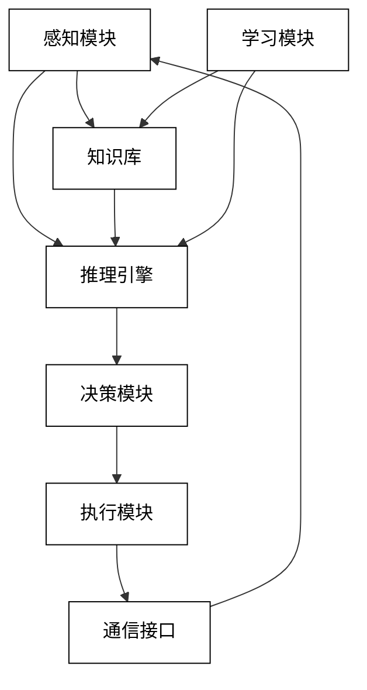
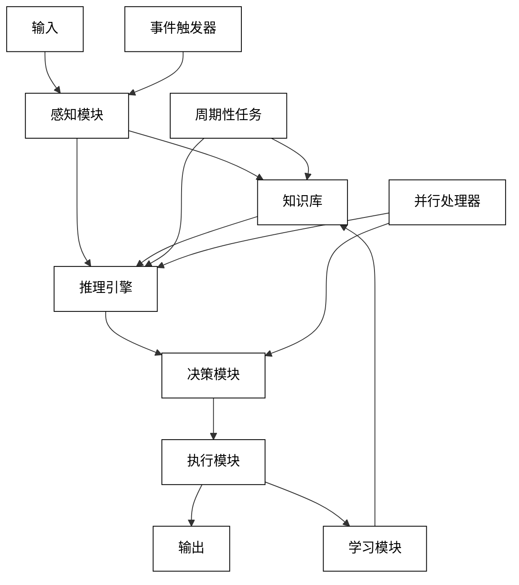

# 第二部分：AI Agent 设计与实现

# 第3章：AI Agent 架构设计

## 3.1 AI Agent 总体架构

设计一个高效、可扩展的 AI Agent 架构是构建成功系统的关键。本节将探讨 AI Agent 的总体架构设计原则和关键组件。

### 3.1.1 模块化设计原则

模块化设计是 AI Agent 架构的核心原则，它提供了以下优势：

1. **可维护性**：易于更新和修改单个模块
2. **可扩展性**：方便添加新功能或改进现有功能
3. **可重用性**：模块可以在不同的 Agent 或项目中重复使用
4. **测试性**：可以独立测试每个模块，简化调试过程

主要模块：

1. 感知模块
2. 知识库
3. 推理引擎
4. 决策模块
5. 执行模块
6. 学习模块
7. 通信接口

模块化架构示意图：



实现模块化设计的代码示例：

```python
class PerceptionModule:
    def process_input(self, input_data):
        # 处理输入数据
        pass

class KnowledgeBase:
    def query(self, query):
        # 查询知识库
        pass

    def update(self, new_knowledge):
        # 更新知识库
        pass

class ReasoningEngine:
    def __init__(self, knowledge_base):
        self.knowledge_base = knowledge_base

    def reason(self, query):
        # 基于知识库进行推理
        pass

class DecisionModule:
    def make_decision(self, reasoning_result):
        # 基于推理结果做出决策
        pass

class ExecutionModule:
    def execute(self, decision):
        # 执行决策
        pass

class LearningModule:
    def learn(self, experience):
        # 从经验中学习
        pass

class CommunicationInterface:
    def send_message(self, message):
        # 发送消息
        pass

    def receive_message(self):
        # 接收消息
        pass

class AIAgent:
    def __init__(self):
        self.perception = PerceptionModule()
        self.knowledge_base = KnowledgeBase()
        self.reasoning = ReasoningEngine(self.knowledge_base)
        self.decision = DecisionModule()
        self.execution = ExecutionModule()
        self.learning = LearningModule()
        self.communication = CommunicationInterface()

    def run(self, input_data):
        perceived_data = self.perception.process_input(input_data)
        reasoning_result = self.reasoning.reason(perceived_data)
        decision = self.decision.make_decision(reasoning_result)
        self.execution.execute(decision)
        self.learning.learn({"input": input_data, "decision": decision})
        return decision

# 使用示例
agent = AIAgent()
result = agent.run("Some input data")
print(result)
```

### 3.1.2 数据流与控制流

在 AI Agent 中，数据流和控制流的设计对系统的效率和响应性至关重要。

数据流：

1. **输入处理**：从感知模块到知识库和推理引擎
2. **知识查询**：从推理引擎到知识库
3. **推理结果**：从推理引擎到决策模块
4. **决策输出**：从决策模块到执行模块
5. **反馈循环**：从执行模块回到学习模块和知识库

控制流：

1. **事件驱动**：基于外部输入或内部状态变化触发处理
2. **周期性处理**：定期执行某些任务，如状态更新或学习
3. **并行处理**：同时执行多个模块的操作
4. **优先级调度**：根据任务重要性安排处理顺序

数据流和控制流示意图：



实现数据流和控制流的代码示例：

```python
import asyncio
from queue import PriorityQueue

class AIAgent:
    def __init__(self):
        self.event_queue = PriorityQueue()
        self.knowledge_base = {}
        self.state = {}

    async def run(self):
        while True:
            priority, event = await self.event_queue.get()
            await self.process_event(event)

    async def process_event(self, event):
        if event['type'] == 'input':
            await self.handle_input(event['data'])
        elif event['type'] == 'periodic_update':
            await self.update_state()
        elif event['type'] == 'learning':
            await self.learn()

    async def handle_input(self, input_data):
        processed_data = self.process_input(input_data)
        reasoning_result = self.reason(processed_data)
        decision = self.make_decision(reasoning_result)
        await self.execute(decision)

    def process_input(self, input_data):
        # 处理输入数据
        return input_data

    def reason(self, data):
        # 基于知识库进行推理
        return f"Reasoning about {data}"

    def make_decision(self, reasoning_result):
        # 基于推理结果做出决策
        return f"Decision based on {reasoning_result}"

    async def execute(self, decision):
        # 执行决策
        print(f"Executing: {decision}")

    async def update_state(self):
        # 更新 Agent 的内部状态
        self.state['last_update'] = asyncio.get_event_loop().time()

    async def learn(self):
        # 从经验中学习并更新知识库
        self.knowledge_base['learned_item'] = f"Learned at {asyncio.get_event_loop().time()}"

    def add_event(self, priority, event):
        self.event_queue.put_nowait((priority, event))

# 使用示例
async def main():
    agent = AIAgent()
    
    # 添加事件
    agent.add_event(1, {'type': 'input', 'data': 'Some input'})
    agent.add_event(2, {'type': 'periodic_update'})
    agent.add_event(3, {'type': 'learning'})

    # 运行 agent
    await asyncio.gather(
        agent.run(),
        asyncio.sleep(5)  # 运行 5 秒后停止
    )

asyncio.run(main())
```

### 3.1.3 可扩展性考虑

设计可扩展的 AI Agent 架构需要考虑以下几个方面：

1. **模块化接口**：定义清晰的模块间接口，便于替换或升级单个模块
2. **可配置性**：使用配置文件或参数来控制 Agent 的行为，避免硬编码
3. **插件系统**：允许动态加载新功能或模型
4. **分布式架构**：支持跨多个服务器或设备分布 Agent 的组件
5. **版本控制**：管理 Agent 组件和知识库的不同版本
6. **性能监控**：集成监控和日志系统，便于诊断和优化

可扩展架构示例：

```python
import importlib
import yaml

class PluginManager:
    def __init__(self):
        self.plugins = {}

    def load_plugin(self, name, path):
        module = importlib.import_module(path)
        self.plugins[name] = module.Plugin()

    def get_plugin(self, name):
        return self.plugins.get(name)

class ConfigManager:
    def __init__(self, config_path):
        with open(config_path, 'r') as file:
            self.config = yaml.safe_load(file)

    def get(self, key, default=None):
        return self.config.get(key, default)

class AIAgent:
    def __init__(self, config_path):
        self.config = ConfigManager(config_path)
        self.plugin_manager = PluginManager()
        self.load_plugins()

    def load_plugins(self):
        plugins = self.config.get('plugins', {})
        for name, path in plugins.items():
            self.plugin_manager.load_plugin(name, path)

    def run(self, input_data):
        perception_plugin = self.plugin_manager.get_plugin('perception')
        reasoning_plugin = self.plugin_manager.get_plugin('reasoning')
        decision_plugin = self.plugin_manager.get_plugin('decision')

        perceived_data = perception_plugin.process(input_data)
        reasoning_result = reasoning_plugin.reason(perceived_data)
        decision = decision_plugin.decide(reasoning_result)

        return decision

# 配置文件示例 (config.yaml):
# plugins:
#   perception: perception_module
#   reasoning: reasoning_module
#   decision: decision_module

# 使用示例
agent = AIAgent('config.yaml')
result = agent.run("Some input data")
print(result)
```

这种可扩展的架构允许轻松添加新功能、更换算法或模型，以及根据需求调整 Agent 的行为。通过使用插件系统和配置管理，我们可以在不修改核心代码的情况下扩展 Agent 的能力。

在实际应用中，可能还需要考虑分布式计算、负载均衡、故障恢复等更复杂的可扩展性问题。这些可以通过使用微服务架构、消息队列、容器化技术等现代软件工程实践来解决。

## 3.2 输入处理模块

输入处理模块是 AI Agent 的前端，负责接收和解析来自环境或用户的输入。设计一个高效的输入处理模块对于 Agent 的整体性能至关重要。

### 3.2.1 自然语言理解

自然语言理解（NLU）是处理文本或语音输入的关键组件。它涉及多个子任务：

1. **分词**：将输入文本分割成单词或子词
2. **词性标注**：识别每个词的语法角色
3. **命名实体识别**：识别文本中的人名、地名、组织等实体
4. **依存句法分析**：分析词语之间的语法关系
5. **语义角色标注**：识别谓词-论元结构
6. **意图识别**：理解用户的整体目的
7. **槽位填充**：提取意图相关的具体信息

示例代码（使用 spaCy 库）：

```python
import spacy

class NLUModule:
    def __init__(self):
        self.nlp = spacy.load("en_core_web_sm")

    def process(self, text):
        doc = self.nlp(text)
        
        # 分词和词性标注
        tokens = [(token.text, token.pos_) for token in doc]
        
        # 命名实体识别
        entities = [(ent.text, ent.label_) for ent in doc.ents]
        
        # 依存句法分析
        dependencies = [(token.text, token.dep_, token.head.text) for token in doc]
        
        # 简单的意图识别（基于规则）
        intent = self.identify_intent(doc)
        
        return {
            "tokens": tokens,
            "entities": entities,
            "dependencies": dependencies,
            "intent": intent
        }

    def identify_intent(self, doc):
        # 简化的意图识别逻辑
        if any(token.lower_ in ["what", "who", "where", "when", "why", "how"] for token in doc):
            return "question"
        elif any(token.lower_ in ["can", "could", "would", "will"] for token in doc):
            return "request"
        else:
            return "statement"

# 使用示例
nlu = NLUModule()
result = nlu.process("What's the weather like in New York today?")
print(result)
```

### 3.2.2 多模态输入处理

现代 AI Agent 常需要处理多种类型的输入，如文本、图像、音频和视频。多模态输入处理涉及：

1. **图像处理**：物体检测、图像分类、图像分割
2. **音频处理**：语音识别、音频事件检测
3. **视频处理**：动作识别、场景理解
4. **多模态融合**：整合不同模态的信息

示例代码（使用 PyTorch 和预训练模型）：

```python
import torch
from torchvision.models import resnet50
from torchvision.transforms import Compose, Resize, ToTensor, Normalize
from PIL import Image

class MultiModalInputProcessor:
    def __init__(self):
        self.image_model = resnet50(pretrained=True)
        self.image_model.eval()
        self.image_transform = Compose([
            Resize(256),
            ToTensor(),
            Normalize(mean=[0.485, 0.456, 0.406], std=[0.229, 0.224, 0.225])
        ])

    def process_image(self, image_path):
        image = Image.open(image_path).convert('RGB')
        image_tensor = self.image_transform(image).unsqueeze(0)
        
        with torch.no_grad():
            output = self.image_model(image_tensor)
        
        # 获取最可能的类别
        _, predicted = torch.max(output, 1)
        return predicted.item()

    def process_text(self, text):
        # 这里使用之前的 NLUModule
        nlu = NLUModule()return nlu.process(text)

    def process_audio(self, audio_path):
        # 简化的音频处理示例
        # 实际应用中可能需要使用专门的语音识别模型
        return "Audio processing not implemented"

    def fuse_modalities(self, image_result, text_result, audio_result):
        # 简单的多模态融合策略
        # 实际应用中可能需要更复杂的融合方法
        return {
            "image": image_result,
            "text": text_result,
            "audio": audio_result
        }

# 使用示例
processor = MultiModalInputProcessor()
image_result = processor.process_image("example.jpg")
text_result = processor.process_text("What's in this image?")
audio_result = processor.process_audio("example.wav")

fused_result = processor.fuse_modalities(image_result, text_result, audio_result)
print(fused_result)
```

### 3.2.3 上下文管理

上下文管理对于维护连贯的交互至关重要，特别是在多轮对话或复杂任务中。有效的上下文管理包括：

1. **会话历史跟踪**：记录之前的交互
2. **状态维护**：跟踪当前任务的进度和状态
3. **上下文相关性判断**：确定历史信息的相关性
4. **上下文融合**：将新信息与历史上下文整合

示例代码：

```python
from collections import deque

class ContextManager:
    def __init__(self, max_history=5):
        self.conversation_history = deque(maxlen=max_history)
        self.current_state = {}

    def add_to_history(self, user_input, agent_response):
        self.conversation_history.append({
            "user": user_input,
            "agent": agent_response
        })

    def update_state(self, key, value):
        self.current_state[key] = value

    def get_relevant_context(self, current_input):
        # 简单的相关性判断，基于关键词匹配
        relevant_history = []
        for interaction in self.conversation_history:
            if any(word in interaction["user"] for word in current_input.split()):
                relevant_history.append(interaction)
        return relevant_history

    def get_context(self, current_input):
        return {
            "history": self.get_relevant_context(current_input),
            "state": self.current_state
        }

class InputProcessor:
    def __init__(self):
        self.nlu = NLUModule()
        self.context_manager = ContextManager()

    def process(self, user_input):
        nlu_result = self.nlu.process(user_input)
        context = self.context_manager.get_context(user_input)
        
        # 融合 NLU 结果和上下文
        processed_input = {
            "nlu": nlu_result,
            "context": context
        }
        
        return processed_input

    def update_context(self, user_input, agent_response):
        self.context_manager.add_to_history(user_input, agent_response)
        # 更新状态（示例）
        if "weather" in user_input.lower():
            self.context_manager.update_state("last_topic", "weather")

# 使用示例
processor = InputProcessor()

# 模拟对话
conversations = [
    "What's the weather like today?",
    "How about tomorrow?",
    "Thank you, can you recommend a restaurant?",
    "What cuisine does it serve?"
]

for user_input in conversations:
    result = processor.process(user_input)
    print(f"User: {user_input}")
    print(f"Processed: {result}")
    
    # 模拟 agent 响应
    agent_response = f"Processed your request about {result['nlu']['intent']}"
    processor.update_context(user_input, agent_response)
    print(f"Agent: {agent_response}\n")
```

这个输入处理模块结合了自然语言理解、多模态处理和上下文管理，为 AI Agent 提供了丰富的输入理解能力。它能够处理文本、图像和音频输入，同时维护对话历史和当前状态，从而支持更智能、更连贯的交互。

在实际应用中，可能需要进一步优化和扩展这些组件：

1. 使用更先进的 NLU 模型，如基于 BERT 或 GPT 的模型，以提高语言理解能力。
2. 集成专门的语音识别系统来处理音频输入。
3. 实现更复杂的多模态融合算法，如注意力机制或跨模态转换器。
4. 开发更智能的上下文相关性判断算法，可能涉及语义相似度计算或主题建模。
5. 考虑隐私和安全问题，实现安全的数据存储和访问控制机制。

通过不断改进和优化输入处理模块，我们可以为 AI Agent 提供更准确、更全面的环境感知能力，从而支持更高级的推理和决策功能。

## 3.3 任务规划模块

任务规划模块负责将高级目标分解为可执行的子任务，并为这些子任务制定执行计划。这个模块是 AI Agent 智能行为的核心，使其能够处理复杂的、多步骤的问题。

### 3.3.1 目标分解

目标分解是将复杂任务拆分为更小、更易管理的子任务的过程。这个过程涉及：

1. **任务分析**：理解主要目标的要求和约束
2. **子目标识别**：确定实现主要目标所需的中间步骤
3. **依赖关系建模**：确定子任务之间的先后顺序和依赖关系
4. **资源评估**：估计每个子任务所需的时间和资源

示例代码：

```python
from typing import List, Dict

class Task:
    def __init__(self, name: str, description: str, dependencies: List[str] = None):
        self.name = name
        self.description = description
        self.dependencies = dependencies or []

class GoalDecomposer:
    def __init__(self):
        self.task_library = {}

    def add_task(self, task: Task):
        self.task_library[task.name] = task

    def decompose_goal(self, goal: str) -> List[Task]:
        # 简化的目标分解逻辑
        if goal == "Make dinner":
            return [
                self.task_library["check_ingredients"],
                self.task_library["prepare_ingredients"],
                self.task_library["cook_meal"],
                self.task_library["set_table"],
                self.task_library["serve_food"]
            ]
        elif goal == "Plan a trip":
            return [
                self.task_library["choose_destination"],
                self.task_library["book_transportation"],
                self.task_library["book_accommodation"],
                self.task_library["plan_activities"],
                self.task_library["pack_luggage"]
            ]
        else:
            return [Task(goal, "Unrecognized goal, treat as single task")]

    def create_dependency_graph(self, tasks: List[Task]) -> Dict[str, List[str]]:
        graph = {}
        for task in tasks:
            graph[task.name] = task.dependencies
        return graph

# 使用示例
decomposer = GoalDecomposer()

# 添加任务到库
decomposer.add_task(Task("check_ingredients", "Check available ingredients", []))
decomposer.add_task(Task("prepare_ingredients", "Prepare and measure ingredients", ["check_ingredients"]))
decomposer.add_task(Task("cook_meal", "Cook the meal", ["prepare_ingredients"]))
decomposer.add_task(Task("set_table", "Set the table", []))
decomposer.add_task(Task("serve_food", "Serve the cooked food", ["cook_meal", "set_table"]))

# 分解目标
goal = "Make dinner"
tasks = decomposer.decompose_goal(goal)
dependency_graph = decomposer.create_dependency_graph(tasks)

print(f"Goal: {goal}")
print("Decomposed tasks:")
for task in tasks:
    print(f"- {task.name}: {task.description}")
print("\nDependency graph:")
print(dependency_graph)
```

### 3.3.2 任务优先级排序

一旦目标被分解为子任务，下一步是确定这些任务的执行顺序。任务优先级排序考虑以下因素：

1. **紧急性**：任务的时间敏感度
2. **重要性**：任务对整体目标的贡献程度
3. **依赖关系**：基于任务间的前置条件
4. **资源可用性**：考虑当前可用的资源和约束
5. **预期收益**：完成任务可能带来的价值

示例代码：

```python
from queue import PriorityQueue

class PrioritizedTask:
    def __init__(self, task: Task, priority: int):
        self.task = task
        self.priority = priority

    def __lt__(self, other):
        return self.priority < other.priority

class TaskPrioritizer:
    def __init__(self):
        self.priority_queue = PriorityQueue()

    def add_task(self, task: Task, priority: int):
        self.priority_queue.put(PrioritizedTask(task, priority))

    def get_next_task(self) -> Task:
        if not self.priority_queue.empty():
            return self.priority_queue.get().task
        return None

    def prioritize_tasks(self, tasks: List[Task], dependency_graph: Dict[str, List[str]]) -> List[Task]:
        # 使用拓扑排序确保依赖关系得到满足
        in_degree = {task.name: 0 for task in tasks}
        for dependencies in dependency_graph.values():
            for dep in dependencies:
                in_degree[dep] += 1

        # 初始化优先级队列
        for task in tasks:
            if in_degree[task.name] == 0:
                # 优先级可以基于更复杂的逻辑来确定
                priority = len(dependency_graph[task.name])
                self.add_task(task, priority)

        prioritized_tasks = []
        while not self.priority_queue.empty():
            task = self.get_next_task()
            prioritized_tasks.append(task)
            for dependent in dependency_graph[task.name]:
                in_degree[dependent] -= 1
                if in_degree[dependent] == 0:
                    dependent_task = next(t for t in tasks if t.name == dependent)
                    priority = len(dependency_graph[dependent])
                    self.add_task(dependent_task, priority)

        return prioritized_tasks

# 使用示例
prioritizer = TaskPrioritizer()
prioritized_tasks = prioritizer.prioritize_tasks(tasks, dependency_graph)

print("\nPrioritized task order:")
for task in prioritized_tasks:
    print(f"- {task.name}")
```

### 3.3.3 资源分配

资源分配涉及将可用资源（如时间、计算能力、内存等）分配给各个任务。有效的资源分配可以优化整体性能并确保任务的顺利完成。

资源分配策略包括：

1. **静态分配**：预先为每个任务分配固定的资源
2. **动态分配**：根据实时需求和可用性调整资源分配
3. **优先级基础分配**：根据任务优先级分配资源
4. **负载均衡**：确保资源在不同任务间均匀分布

示例代码：

```python
from typing import Dict

class Resource:
    def __init__(self, name: str, capacity: int):
        self.name = name
        self.capacity = capacity
        self.available = capacity

    def allocate(self, amount: int) -> bool:
        if amount <= self.available:
            self.available -= amount
            return True
        return False

    def release(self, amount: int):
        self.available = min(self.capacity, self.available + amount)

class ResourceAllocator:
    def __init__(self):
        self.resources = {}

    def add_resource(self, resource: Resource):
        self.resources[resource.name] = resource

    def allocate_resources(self, task: Task, required_resources: Dict[str, int]) -> bool:
        allocated_resources = {}
        for resource_name, amount in required_resources.items():
            if resource_name in self.resources:
                if self.resources[resource_name].allocate(amount):
                    allocated_resources[resource_name] = amount
                else:
                    # 回滚已分配的资源
                    for alloc_name, alloc_amount in allocated_resources.items():
                        self.resources[alloc_name].release(alloc_amount)
                    return False
            else:
                return False
        return True

    def release_resources(self, task: Task, allocated_resources: Dict[str, int]):
        for resource_name, amount in allocated_resources.items():
            self.resources[resource_name].release(amount)

# 使用示例
allocator = ResourceAllocator()
allocator.add_resource(Resource("CPU", 100))
allocator.add_resource(Resource("Memory", 1000))

# 为任务分配资源
task = tasks[0]  # 假设使用之前创建的任务列表
required_resources = {"CPU": 20, "Memory": 200}

if allocator.allocate_resources(task, required_resources):
    print(f"Resources allocated for task: {task.name}")
    # 执行任务...
    # 任务完成后释放资源
    allocator.release_resources(task, required_resources)
else:
    print(f"Failed to allocate resources for task: {task.name}")

# 检查资源状态
for resource_name, resource in allocator.resources.items():
    print(f"{resource_name}: {resource.available}/{resource.capacity}")
```

这个任务规划模块提供了目标分解、任务优先级排序和资源分配的基本框架。在实际应用中，可能需要进一步优化和扩展：

1. 实现更复杂的目标分解算法，可能涉及机器学习或规则引擎。
2. 开发动态优先级调整机制，根据环境变化和任务执行情况实时调整优先级。
3. 实现更高级的资源分配策略，如预测性分配或基于历史数据的优化。
4. 集成监控和反馈机制，以便在执行过程中调整计划。
5. 考虑并行执行和任务依赖关系，以提高整体效率。
6. 实现错误处理和恢复机制，以应对任务执行过程中的意外情况。

通过这些优化，任务规划模块可以更好地适应复杂的实际场景，提高 AI Agent 的问题解决能力和效率。

## 3.4 知识检索模块

知识检索模块是 AI Agent 智能决策的关键组件，负责从知识库中快速、准确地检索相关信息。一个高效的知识检索系统可以显著提升 Agent 的响应速度和准确性。

### 3.4.1 知识库设计

知识库是存储和组织信息的核心系统。设计良好的知识库应具备以下特征：

1. **结构化存储**：使用适当的数据结构组织信息
2. **灵活性**：能够容纳不同类型和格式的知识
3. **可扩展性**：支持知识的持续添加和更新
4. **高效索引**：支持快速检索和查询
5. **版本控制**：跟踪知识的变更历史

示例代码（使用 SQLite 作为简单的知识库）：

```python
import sqlite3
from typing import List, Dict, Any

class KnowledgeBase:
    def __init__(self, db_name: str):
        self.conn = sqlite3.connect(db_name)
        self.cursor = self.conn.cursor()
        self.create_tables()

    def create_tables(self):
        self.cursor.execute('''
        CREATE TABLE IF NOT EXISTS knowledge (
            id INTEGER PRIMARY KEY,
            category TEXT,
            content TEXT,
            metadata TEXT
        )
        ''')
        self.conn.commit()

    def add_knowledge(self, category: str, content: str, metadata: Dict[str, Any]):
        self.cursor.execute('''
        INSERT INTO knowledge (category, content, metadata)
        VALUES (?, ?, ?)
        ''', (category, content, str(metadata)))
        self.conn.commit()

    def get_knowledge(self, category: str) -> List[Dict[str, Any]]:
        self.cursor.execute('''
        SELECT * FROM knowledge WHERE category = ?
        ''', (category,))
        rows = self.cursor.fetchall()
        return [{'id': row[0], 'category': row[1], 'content': row[2], 'metadata': eval(row[3])} for row in rows]

    def update_knowledge(self, id: int, content: str, metadata: Dict[str, Any]):
        self.cursor.execute('''
        UPDATE knowledge SET content = ?, metadata = ? WHERE id = ?
        ''', (content, str(metadata), id))
        self.conn.commit()

    def delete_knowledge(self, id: int):
        self.cursor.execute('DELETE FROM knowledge WHERE id = ?', (id,))
        self.conn.commit()

    def close(self):
        self.conn.close()

# 使用示例
kb = KnowledgeBase('agent_knowledge.db')

# 添加知识
kb.add_knowledge('weather', 'The weather in New York is sunny today.', {'date': '2023-05-20', 'source': 'weather.com'})
kb.add_knowledge('restaurants', 'The best Italian restaurant in the city is La Bella Italia.', {'rating': 4.8, 'price': '$$'})

# 检索知识
weather_info = kb.get_knowledge('weather')
print("Weather information:", weather_info)

restaurant_info = kb.get_knowledge('restaurants')
print("Restaurant information:", restaurant_info)

kb.close()
```

### 3.4.2 检索算法选择

选择合适的检索算法对于快速准确地找到相关信息至关重要。常用的检索算法包括：

1. **关键词匹配**：基于关键词的简单匹配
2. **向量空间模型**：将文档和查询转换为向量，计算相似度
3. **概率模型**：基于概率理论的检索方法
4. **语义检索**：利用深度学习模型捕捉语义信息
5. **图形检索**：基于知识图谱的检索方法

示例代码（实现简单的 TF-IDF 检索）：

```python
from sklearn.feature_extraction.text import TfidfVectorizer
from sklearn.metrics.pairwise import cosine_similarity
import numpy as np

class TfidfRetriever:
    def __init__(self):
        self.vectorizer = TfidfVectorizer()
        self.tfidf_matrix = None
        self.documents = []

    def add_documents(self, documents: List[str]):
        self.documents.extend(documents)
        self.tfidf_matrix = self.vectorizer.fit_transform(self.documents)

    def retrieve(self, query: str, top_k: int = 5) -> List[Tuple[int, float]]:
        query_vector = self.vectorizer.transform([query])
        similarities = cosine_similarity(query_vector, self.tfidf_matrix).flatten()
        top_indices = similarities.argsort()[-top_k:][::-1]
        return [(idx, similarities[idx]) for idx in top_indices]

# 使用示例
retriever = TfidfRetriever()

# 添加文档
documents = [
    "The quick brown fox jumps over the lazy dog",
    "A journey of a thousand miles begins with a single step",
    "To be or not to be, that is the question",
    "All that glitters is not gold",
    "Where there's a will, there's a way"
]
retriever.add_documents(documents)

# 执行检索
query = "How to start a long journey?"
results = retriever.retrieve(query)

print(f"Query: {query}")
print("Top matching documents:")
for idx, score in results:
    print(f"- Document {idx}: '{documents[idx]}' (Score: {score:.4f})")
```

### 3.4.3 结果排序与筛选

检索到相关信息后，需要对结果进行排序和筛选，以提供最相关和最有用的信息。这个过程包括：

1. **相关性排序**：基于与查询的相似度对结果排序
2. **多样性考虑**：确保结果集包含不同方面的信息
3. **时效性评估**：考虑信息的新鲜度
4. **可信度评估**：考虑信息源的可靠性
5. **个性化排序**：根据用户偏好或上下文调整排序

示例代码（结合相关性和时效性的排序）：

```python
from datetime import datetime

class RetrievalResult:
    def __init__(self, document: str, relevance: float, timestamp: datetime):
        self.document = document
        self.relevance = relevance
        self.timestamp = timestamp

    def __lt__(self, other):
        return self.score() < other.score()

    def score(self):
        # 结合相关性和时效性的得分
        time_factor = 1.0 / (1.0 + (datetime.now() - self.timestamp).days)
        return self.relevance * time_factor

class ResultRanker:
    def __init__(self, results: List[RetrievalResult]):
        self.results = results

    def rank(self) -> List[RetrievalResult]:
        return sorted(self.results, reverse=True)

    def diversify(self, ranked_results: List[RetrievalResult], diversity_threshold: float) -> List[RetrievalResult]:
        diversified = [ranked_results[0]]
        for result in ranked_results[1:]:
            if all(self.similarity(result.document, div.document) < diversity_threshold for div in diversified):
                diversified.append(result)
        return diversified

    def similarity(self, doc1: str, doc2: str) -> float:
        # 简单的相似度计算，实际应用中可能需要更复杂的方法
        words1 = set(doc1.lower().split())
        words2 = set(doc2.lower().split())
        return len(words1.intersection(words2)) / len(words1.union(words2))

# 使用示例
results = [
    RetrievalResult("The quick brown fox jumps over the lazy dog", 0.8, datetime(2023, 5, 1)),
    RetrievalResult("A journey of a thousand miles begins with a single step", 0.7, datetime(2023, 5, 15)),
    RetrievalResult("To be or not to be, that is the question", 0.6, datetime(2023, 5, 20)),
    RetrievalResult("All that glitters is not gold", 0.5, datetime(2023, 5, 10)),
    RetrievalResult("Where there's a will, there's a way", 0.4, datetime(2023, 5, 18))
]

ranker = ResultRanker(results)
ranked_results = ranker.rank()
diversified_results = ranker.diversify(ranked_results, diversity_threshold=0.3)

print("Ranked and diversified results:")
for result in diversified_results:
    print(f"- {result.document} (Score: {result.score():.4f})")
```

这个知识检索模块提供了基本的知识存储、检索和结果排序功能。在实际应用中，可能需要进一步优化和扩展：

1. 使用更高级的数据库系统（如 Elasticsearch）来处理大规模知识库。
2. 实现更复杂的检索算法，如基于深度学习的语义检索。
3. 集成知识图谱，支持更复杂的关系查询和推理。
4. 实现增量更新和实时索引，以支持动态知识库。
5. 添加缓存机制，提高频繁查询的响应速度。
6. 实现分布式检索，以处理超大规模的知识库。

通过这些优化，知识检索模块可以更好地支持 AI Agent 的决策过程，提供更准确、更相关的信息。

## 3.5 推理与决策模块

推理与决策模块是 AI Agent 的核心智能组件，负责基于输入、知识和目标做出合理的决策。这个模块结合了多种推理技术，以适应不同类型的问题和场景。

### 3.5.1 基于规则的推理

基于规则的推理使用预定义的 if-then 规则来进行决策。这种方法适用于结构化、明确定义的问题域。

优点：
- 易于理解和解释
- 适合处理确定性问题
- 可以快速实现和部署

缺点：
- 难以处理复杂或模糊的情况
- 规则库维护可能变得复杂
- 缺乏学习和适应能力

示例代码：

```python
class Rule:
    def __init__(self, condition, action):
        self.condition = condition
        self.action = action

class RuleBasedReasoner:
    def __init__(self):
        self.rules = []

    def add_rule(self, rule):
        self.rules.append(rule)

    def reason(self, facts):
        for rule in self.rules:
            if rule.condition(facts):
                return rule.action(facts)
        return None

# 使用示例
reasoner = RuleBasedReasoner()

# 添加规则
reasoner.add_rule(Rule(
    condition=lambda facts: facts.get('temperature') > 30,
    action=lambda facts: "It's hot, turn on the AC"
))
reasoner.add_rule(Rule(
    condition=lambda facts: facts.get('temperature') < 10,
    action=lambda facts: "It's cold, turn on the heater"
))
reasoner.add_rule(Rule(
    condition=lambda facts: 10 <= facts.get('temperature') <= 30,
    action=lambda facts: "The temperature is comfortable"
))

# 使用规则进行推理
facts = {'temperature': 35}
decision = reasoner.reason(facts)
print(f"Temperature: {facts['temperature']}°C")
print(f"Decision: {decision}")
```

### 3.5.2 基于 LLM 的推理

基于大语言模型（LLM）的推理利用预训练的语言模型来生成或选择决策。这种方法特别适合处理自然语言输入和开放域问题。

优点：
- 能处理复杂、模糊的问题
- 具有强大的语言理解和生成能力
- 可以利用大规模预训练知识

缺点：
- 可能需要大量计算资源
- 决策过程可能不够透明
- 可能产生不一致或不准确的结果

示例代码（使用 OpenAI API）：

```python
import openai

class LLMReasoner:
    def __init__(self, api_key):
        openai.api_key = api_key

    def reason(self, prompt):
        response = openai.Completion.create(
            engine="text-davinci-002",
            prompt=prompt,
            max_tokens=100,
            n=1,
            stop=None,
            temperature=0.7,
        )
        return response.choices[0].text.strip()

# 使用示例
llm_reasoner = LLMReasoner("your-api-key-here")

# 使用 LLM 进行推理
situation = "A customer is complaining about a delayed shipment."
prompt = f"Given the following situation: '{situation}' What should the customer service representative do? Provide a step-by-step response."

decision = llm_reasoner.reason(prompt)
print(f"Situation: {situation}")
print(f"Decision:\n{decision}")
```

### 3.5.3 混合推理策略

混合推理策略结合了多种推理方法的优点，以适应不同类型的问题和情况。这种方法可以提高决策的准确性和鲁棒性。

实现混合推理的方法：
1. **级联方法**：按顺序使用不同的推理方法，直到得到满意的结果
2. **并行方法**：同时使用多种推理方法，然后综合结果
3. **加权组合**：根据可信度或适用性对不同方法的结果进行加权
4. **元学习**：使用机器学习来选择或组合不同的推理方法

示例代码（级联方法）：

```python
class HybridReasoner:
    def __init__(self, rule_based_reasoner, llm_reasoner):
        self.rule_based_reasoner = rule_based_reasoner
        self.llm_reasoner = llm_reasoner

    def reason(self, facts, situation):
        # 首先尝试基于规则的推理
        rule_based_decision = self.rule_based_reasoner.reason(facts)
        
        if rule_based_decision:
            return rule_based_decision
        
        # 如果基于规则的推理无法得出结论，使用 LLM 推理
        prompt = f"Given the following situation and facts:\nSituation: {situation}\nFacts: {facts}\nWhat decision should be made?"
        llm_decision = self.llm_reasoner.reason(prompt)
        
        return llm_decision

# 使用示例
hybrid_reasoner = HybridReasoner(reasoner, llm_reasoner)

# 混合推理
facts = {'temperature': 22, 'humidity': 60}
situation = "A customer is asking for advice on room climate control."
decision = hybrid_reasoner.reason(facts, situation)
print(f"Facts: {facts}")
print(f"Situation: {situation}")
print(f"Decision: {decision}")
```

在实际应用中，推理与决策模块可能需要进一步优化和扩展：

1. 实现更复杂的规则引擎，支持不确定性和模糊逻辑。
2. 集成机器学习模型，如决策树或随机森林，用于处理结构化数据。
3. 实现基于案例的推理（CBR），利用历史案例进行决策。
4. 开发解释性机制，使决策过程更透明、可解释。
5. 实现在线学习，根据反馈不断优化决策策略。
6. 集成多智能体协作决策机制，处理复杂的分布式问题。

通过这些优化，推理与决策模块可以更好地适应各种复杂场景，提高 AI Agent 的智能水平和决策质量。

## 3.6 输出生成模块

输出生成模块负责将 AI Agent 的决策转化为用户可理解和可执行的形式。这个模块对于确保 Agent 与用户之间的有效沟通至关重要。

### 3.6.1 自然语言生成

自然语言生成（NLG）是将结构化数据或内部表示转换为人类可读文本的过程。

关键技术：
1. **模板基础方法**：使用预定义模板填充信息
2. **基于规则的方法**：使用语法规则构建句子
3. **统计方法**：使用机器学习模型生成文本
4. **神经网络方法**：使用深度学习模型（如 Transformer）生成文本

示例代码（结合模板和神经网络方法）：

```python
import random
from transformers import pipeline

class NLGModule:
    def __init__(self):
        self.templates = {
            'weather': "The weather in {location} is {condition} with a temperature of {temperature}°C.",
            'recommendation': "Based on your preferences, I recommend {item}. {reason}",
            'error': "I'm sorry, but {error_message}. Can you please {suggestion}?"
        }
        self.text_generator = pipeline('text-generation', model='gpt2')

    def generate_from_template(self, template_key, **kwargs):
        template = self.templates.get(template_key)
        if not template:
            return None
        return template.format(**kwargs)

    def generate_with_ai(self, prompt, max_length=50):
        generated = self.text_generator(prompt, max_length=max_length, num_return_sequences=1)
        return generated[0]['generated_text']

    def generate_output(self, intent, data, use_ai=False):
        if use_ai:
            prompt = f"Generate a response for the following intent and data: Intent: {intent}, Data: {data}"
            return self.generate_with_ai(prompt)
        else:
            if intent == 'weather':
                return self.generate_from_template('weather', **data)
            elif intent == 'recommendation':
                return self.generate_from_template('recommendation', **data)
            elif intent == 'error':
                return self.generate_from_template('error', **data)
            else:
                return f"I'm not sure how to respond to that intent: {intent}"

# 使用示例
nlg = NLGModule()

# 使用模板生成
weather_output = nlg.generate_output('weather', {
    'location': 'New York',
    'condition': 'sunny',
    'temperature': 25
})
print("Template-based output:", weather_output)

# 使用 AI 生成
ai_output = nlg.generate_output('recommendation', {
    'item': 'a new smartphone',
    'reason': 'It has excellent camera quality and long battery life.'
}, use_ai=True)
print("AI-generated output:", ai_output)
```

### 3.6.2 多模态输出生成

多模态输出生成涉及创建包含文本、图像、音频或视频的复合输出。这种方法可以提供更丰富、更直观的信息。

关键技术：
1. **文本到图像生成**：使用 GAN 或扩散模型创建图像
2. **文本到语音合成**：将文本转换为自然语音
3. **数据可视化**：将数据转换为图表或图形
4. **多模态融合**：协调不同模态的输出以创建连贯的体验

示例代码（简化的多模态输出生成）：

```python
import matplotlib.pyplot as plt
from PIL import Image
import numpy as np

class MultiModalOutputGenerator:
    def __init__(self, nlg_module):
        self.nlg = nlg_module

    def generate_text(self, intent, data):
        return self.nlg.generate_output(intent, data)

    def generate_image(self, data):
        # 简单的图表生成示例
        plt.figure(figsize=(10, 5))
        plt.bar(data.keys(), data.values())
        plt.title("Data Visualization")
        plt.xlabel("Categories")
        plt.ylabel("Values")
        plt.savefig("output_image.png")
        plt.close()
        return Image.open("output_image.png")

    def generate_audio(self, text):
        # 这里应该使用文本到语音的 API，这里用占位符代替
        print(f"[Audio output would be generated for: '{text}']")

    def generate_multimodal_output(self, intent, data):
        text_output = self.generate_text(intent, data)
        image_output = self.generate_image(data)
        self.generate_audio(text_output)

        return {
            "text": text_output,
            "image": image_output,
            "audio": "[Audio file would be here]"
        }

# 使用示例
multimodal_generator = MultiModalOutputGenerator(nlg)

intent = 'data_report'
data = {'Category A': 30, 'Category B': 45, 'Category C': 60, 'Category D': 25}

output = multimodal_generator.generate_multimodal_output(intent, data)
print("Text output:", output['text'])
output['image'].show()  # 显示生成的图像
print(output['audio'])
```

### 3.6.3 输出质量控制

输出质量控制确保生成的内容准确、相关、连贯且符合预期标准。

关键策略：
1. **一致性检查**：确保输出在不同部分之间保持一致
2. **事实核查**：验证输出中的事实性陈述
3. **语法和拼写检查**：确保语言使用的正确性
4. **风格和语气调整**：根据目标受众调整输出的风格
5. **敏感内容过滤**：移除或修改不适当或有争议的内容

示例代码：

```python
import re
from spellchecker import SpellChecker

class OutputQualityController:
    def __init__(self):
        self.spell_checker = SpellChecker()
        self.sensitive_words = set(['offensive', 'inappropriate', 'controversial'])

    def check_consistency(self, text):
        # 简单的一致性检查示例
        statements = text.split('.')
        for i in range(len(statements) - 1):
            if statements[i].strip() == statements[i+1].strip():
                return False
        return True

    def fact_check(self, text, facts):
        # 简单的事实核查示例
        for fact, value in facts.items():
            if f"{fact} is {value}" not in text:
                return False
        return True

    def grammar_spell_check(self, text):
        words = text.split()
        misspelled = self.spell_checker.unknown(words)
        return list(misspelled)

    def adjust_style(self, text, target_style):
        # 简单的风格调整示例
        if target_style == 'formal':
            text = text.replace("don't", "do not").replace("won't", "will not")
        elif target_style == 'casual':
            text = text.replace("do not", "don't").replace("will not", "won't")
        return text

    def filter_sensitive_content(self, text):
        words = text.split()
        filtered_words = [word for word in words if word.lower() not in self.sensitive_words]
        return ' '.join(filtered_words)

    def control_quality(self, text, facts=None, target_style='neutral'):
        if not self.check_consistency(text):
            text = self.resolve_inconsistency(text)
        
        if facts and not self.fact_check(text, facts):
            text = self.correct_facts(text, facts)
        
        misspelled = self.grammar_spell_check(text)
        for word in misspelled:
            text = text.replace(word, self.spell_checker.correction(word))
        
        text = self.adjust_style(text, target_style)
        text = self.filter_sensitive_content(text)
        
        return text

    def resolve_inconsistency(self, text):
        # 实际应用中，这里应该有更复杂的逻辑
        return "Inconsistencies resolved: " + text

    def correct_facts(self, text, facts):
        # 实际应用中，这里应该有更复杂的逻辑
        for fact, value in facts.items():
            text = re.sub(f"{fact} is .*?\\.", f"{fact} is {value}.", text)
        return text

# 使用示例
qc = OutputQualityController()

original_text = "The wether is sunny today. The wether is rainy today. It won't be a good day for a picnic."
facts = {'weather': 'sunny'}
controlled_text = qc.control_quality(original_text, facts, target_style='formal')

print("Original text:", original_text)
print("Controlled text:", controlled_text)
```

这个输出生成模块提供了基本的自然语言生成、多模态输出生成和质量控制功能。在实际应用中，可能需要进一步优化和扩展：

1. 使用更先进的 NLG 模型，如 GPT-3 或 T5，以生成更自然、更连贯的文本。
2. 实现更复杂的多模态生成技术，如条件图像生成或交互式可视化。
3. 开发更强大的事实核查系统，可能需要集成外部知识库或 API。
4. 实现更细致的风格转换，考虑语气、形式性、专业程度等多个维度。
5. 添加个性化输出功能，根据用户偏好调整内容和呈现方式。
6. 集成实时反馈机制，根据用户反应动态调整输出。

通过这些优化，输出生成模块可以产生更高质量、更个性化、更具吸引力的内容，从而提高 AI Agent 与用户之间的交互效果。